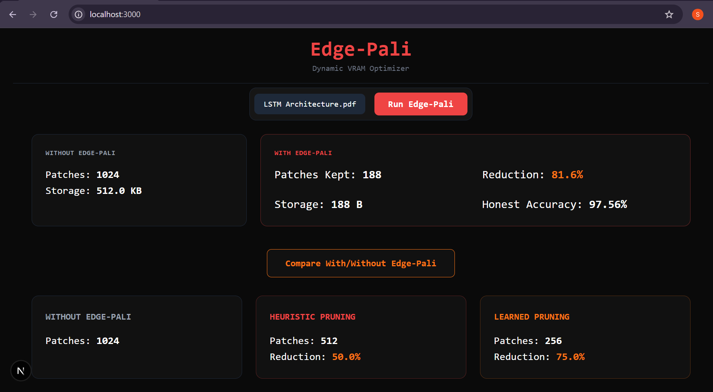

```markdown
<div align="center">

# 🗜️ Edge-Pali

### Dynamic VRAM Optimization and Patch Pruning for Vision-Language Models on Edge Devices

</div>

---

### 🚀 Getting Started

#### Prerequisites
* **Docker & Docker Compose** installed on your machine.
* **Gemini API Key** (Required for the language model backend integration).

#### Local Deployment
To run the full stack in a containerized environment, follow these steps:

1. **Clone the repository:**
   `git clone <your-repo-url>`
   `cd EdgePali`

2. **Configure Environment:**
   Create a `.env` file in the root directory and add your API key:
   `GEMINI_API_KEY=your_actual_api_key_here`

3. **Launch the Containerized Environment:**
   We use Docker Compose for seamless multi-container orchestration (FastAPI backend + Next.js frontend):
   `docker-compose up --build`

4. **Access the Dashboard:**
   Open your browser and navigate to `http://localhost:3000`.

---

### 📊 Performance & Evaluation Results

We evaluated Edge-Pali on complex technical documentation to verify VRAM efficiency and model parity.

<div align="center">

| Model/Paper | Input Type | VRAM Optimization | Result Preview |
| :--- | :--- | :--- | :--- |
| **LSTM Architecture** | 2-page Technical PDF | ~81.6% Reduction |  |
| **Transformer (Attention Is All You Need)** | 11-page Research Paper | ~80.4% Reduction |  |

</div>

---

### 🏗️ System Architecture

```text
                        ┌─────────────────────┐
                        │   File Upload (UI)  │
                        │   PDF / PNG / JPG   │
                        └──────────┬──────────┘
                                   │
                        ┌──────────▼──────────┐
                        │ FastAPI /process-   │
                        │ document endpoint   │
                        └──────────┬──────────┘
                                   │
                        ┌──────────▼──────────┐
                        │ PyMuPDF (PDF→Image) │
                        └──────────┬──────────┘
                                   │
                        ┌──────────▼──────────┐
                        │ ColPali (vidore/    │
                        │ colpali-v1.3)       │
                        │ → [N patches, 128]  │
                        └──────────┬──────────┘
                                   │
                  ┌────────────────┴────────────────┐
                  │                                 │
       ┌──────────▼──────────┐           ┌───────────▼───────────┐
       │ Similarity Heuristic │          │  Trained NN Scorer    │
       │  (cosine sim, O(N²)) │          │  (PatchImportanceScorer│
       │  Teacher / baseline  │          │  best_scorer.pt)      │
       └──────────┬──────────┘           └───────────┬───────────┘
                  └────────────────┬────────────────┘
                                   │
                        ┌──────────▼──────────┐
                        │  INT8 Quantization  │
                        │  (scale + zero-point)│
                        └──────────┬──────────┘
                                   │
                        ┌──────────▼──────────┐
                        │  Next.js Dashboard  │
                        │  Without vs With UI │
                        └─────────────────────┘

```

---

### ⚙️ Technical Highlights

* **Industry-Standard Containerization:** Fully modular architecture with independent Backend and Frontend services managed via Docker Compose.
* **Dual-Path Compression:** Implements both O(N²) heuristic similarity thresholding and O(1) learned neural pruning for real-time edge processing.
* **Asymmetric Evaluation:** Live performance metrics dashboard displaying "Honest Tradeoff Accuracy" versus memory footprint reduction.

---

### 📈 Performance & Optimization Data

**Heuristic Baseline**

* **Average VRAM/Vector Reduction:** **78.01%**
* **Representation Similarity Retained:** **~99.36%**

**Trained Student Model (`best_scorer.pt`)**

* **Final Training Loss:** **0.5798**
* **Agreement with Heuristic Teacher (Unseen Data):** **67.17%**
* **Average Reduction Achieved (Unseen Data):** **46.32%**

---

### 🛠️ Tech Stack

| Layer | Technology |
| --- | --- |
| **Deep Learning** | PyTorch, ColPali, custom `PatchImportanceScorer` |
| **Data Ingestion** | PyMuPDF (PDF→image extraction), Pillow |
| **Backend** | FastAPI, Uvicorn, Python 3.11+ |
| **Frontend** | Next.js 16 (Turbopack), TypeScript, Tailwind CSS v4 |
| **Deployment** | Docker (multi-container orchestration) |

---

### 📝 Pipeline Status

| Phase | Status |
| --- | --- |
| Backend scaffold + dummy pipeline | ✅ Complete |
| Real ColPali validation (heuristic, 9,700 images) | ✅ Complete |
| Learned pruning model (training) | ✅ Complete |
| Frontend dashboard (dummy pipeline) | ✅ Complete |
| Real file upload + live inference endpoint | ✅ Complete |
| Frontend Without/With comparison UI | ✅ Complete |
| End-to-end verified on local (9,700 images) | ✅ Complete |

```

